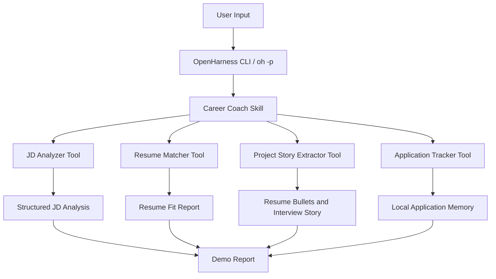

# CareerPilot Agent

[English](README.md) · [简体中文](README.zh-CN.md)


**CareerPilot Agent** is a personalized job-search agent built on top of OpenHarness.

It helps users analyze job descriptions, compare resumes with target roles, rewrite project experience, generate interview preparation plans, and track job applications through a lightweight local workflow.

This project extends OpenHarness with a domain-specific career workflow, custom tools, markdown skills, local memory, structured reports, and automated tests.

---

## Why this project?

Job seekers often need to repeatedly analyze job descriptions, tailor resumes, rewrite project experience, and prepare for interviews. This process is time-consuming and inconsistent when done manually.

CareerPilot Agent turns this process into a structured agent workflow:

```text
Job Description
  -> JD Analysis
  -> Resume Matching
  -> Project Story Extraction
  -> Interview Preparation Plan
  -> Application Tracking
```

The goal of this MVP is not to build a generic chatbot. The goal is to build a practical, testable, and explainable job-search agent on top of OpenHarness.

---

## Built on OpenHarness

OpenHarness provides the agent runtime foundation, including:

- CLI-based agent execution
- Tool-use workflow
- Markdown skill loading
- Local memory patterns
- Permission-aware execution
- Dry-run validation
- Testable Python project structure

CareerPilot extends OpenHarness at the application layer by adding a specialized job-search workflow.

---

## Key Features

### 1. JD Analyzer

Parses a job description and extracts structured job requirements.

Output includes:

- Role summary
- Seniority level
- Core skills
- Nice-to-have skills
- Responsibilities
- Resume keywords
- Interview focus areas
- Risk notes

### 2. Resume Matcher

Compares a resume with the analyzed job description and generates an explainable fit report.

Output includes:

- Match score
- Strong matches
- Missing skills
- Weak evidence
- Keywords to add
- Resume rewrite suggestions
- Interview preparation topics

### 3. Project Story Extractor

Converts a project README or project description into resume-ready and interview-ready material.

Output includes:

- One-line project summary
- Tech stack
- Architecture highlights
- Chinese resume bullets
- English resume bullets
- Interview story
- Possible interview questions

### 4. Application Tracker

Stores job application records in local JSON memory.

It supports:

- Adding application records
- Updating application status
- Querying active applications
- Generating next actions

### 5. OpenHarness Skill Integration

CareerPilot includes markdown-based skills that describe the job-search workflow and guide OpenHarness execution.

Current skills:

```text
careerpilot/skills/
  career-coach.md
  resume-rewriter.md
  interview-prep.md
```

---

## Project Structure

```text
careerpilot/
  __init__.py
  demo.py
  openharness_adapter.py
  tools/
    jd_analyzer.py
    resume_matcher.py
    project_story_extractor.py
    application_tracker.py
  skills/
    career-coach.md
    resume-rewriter.md
    interview-prep.md
  memory/
    applications.json

examples/
  careerpilot/
    sample_jd_backend.md
    sample_resume.md
    sample_project_readme.md
    output_jd_analysis.json
    output_resume_match.md
    output_project_bullets.md
    demo_report.md

tests/
  careerpilot/
    test_jd_analyzer.py
    test_resume_matcher.py
    test_project_story_extractor.py
    test_application_tracker.py

docs/
  dev_log.md
  demo_script.md
  openharness_integration.md
```

---

## Architecture



---

## Quick Start

### 1. Clone the repository

```bash
git clone https://github.com/LYH0438/openharness-careerpilot.git
cd openharness-careerpilot
git checkout feature/careerpilot-agent
```

### 2. Install dependencies

```bash
uv sync
```

### 3. Run CareerPilot demo

```bash
python -m careerpilot.demo \
  --jd examples/careerpilot/sample_jd_backend.md \
  --resume examples/careerpilot/sample_resume.md \
  --project examples/careerpilot/sample_project_readme.md \
  --output examples/careerpilot/demo_report.md
```

### 4. View demo report

```bash
cat examples/careerpilot/demo_report.md
```

---

## OpenHarness Dry Run Example

CareerPilot can also be triggered through an OpenHarness-style prompt.

```bash
uv run oh --dry-run -p "Use career-coach skill. Analyze examples/careerpilot/sample_jd_backend.md and compare it with examples/careerpilot/sample_resume.md. Generate a job-fit report using CareerPilot."
```

The dry-run mode validates prompt assembly, skill discovery, and runtime readiness without executing model calls or tools.

---

## Example Output

CareerPilot generates a complete job-fit report containing:

- Job description analysis
- Resume-job match score
- Missing skill analysis
- Resume rewrite suggestions
- Project story bullets
- Interview preparation topics
- Application tracking summary

Example files are available under:

```text
examples/careerpilot/
```

---

## Testing

Run CareerPilot-specific tests:

```bash
python -m pytest -q tests/careerpilot
```

Current result:

```text
18 passed in 0.05s
```

Run the full OpenHarness test suite:

```bash
python -m pytest -q
```

Current result:

```text
1067 passed, 6 skipped in 23.88s
```

---

## Implementation Details

### Structured outputs

CareerPilot tools return stable dictionaries and structured reports. This makes the workflow easier to test, inspect, and reuse in future automation.

### Explainable matching

The resume matcher uses an explainable scoring strategy based on skill coverage, project evidence coverage, and responsibility coverage.

The score is constrained to the 0-100 range.

### Local memory

The application tracker uses a lightweight JSON file:

```text
careerpilot/memory/applications.json
```

This keeps the MVP simple, inspectable, and easy to demo without requiring a database.

### Skill-based workflow

CareerPilot uses markdown skills to define domain workflows. The skill files describe when to use the workflow, what inputs to expect, what tools to call, and what outputs to produce.

---

## Development Log

The development process is documented in:

```text
docs/dev_log.md
```

Current completed milestones:

- Day 1: OpenHarness environment setup
- Day 2: CareerPilot skill drafts
- Day 3: JD Analyzer Tool
- Day 4: Resume Matcher Tool
- Day 5: Project Story Extractor
- Day 6: Application Tracker
- Day 7: End-to-end demo flow
- Day 8: OpenHarness integration
- Day 9: Tests and stability validation
- Day 10: README first version

---

## Evaluation

CareerPilot v0.2 adds a lightweight benchmark evaluation layer to make JD analysis outputs measurable and regression-testable.

The current benchmark evaluates JD analysis quality across three role-specific samples:

- Backend API Engineer
- AI Agent Engineer
- ML Platform Engineer

Evaluation metrics:

- `keyword_recall`: checks whether extracted JD keywords cover expected benchmark keywords.
- `schema_validity`: checks whether required JD analysis fields are present.
- `report_completeness`: checks whether the generated report contains the expected sections.
- `overall_score`: averages the deterministic metrics into a single quality signal.

Run the benchmark locally:

    python -m careerpilot.evaluation.eval_runner

Current baseline:

    Cases: 3
    Average keyword recall: 0.4045
    Average schema validity: 1.0
    Average report completeness: 1.0
    Average overall score: 0.8015

Generated report:

    benchmarks/eval_report.md

This benchmark is intended for regression tracking and engineering visibility, not as an absolute measure of model quality.

## Roadmap

### v0.1 MVP

- [x] JD Analyzer
- [x] Resume Matcher
- [x] Project Story Extractor
- [x] Application Tracker
- [x] End-to-end demo report
- [x] OpenHarness dry-run integration
- [x] Core tests

### v0.2 Planned Enhancements

- [ ] ohmo / chat channel integration
- [ ] Resume and project knowledge base
- [ ] Multi-agent career workflow
- [ ] Benchmark and quality evaluation
- [ ] GitHub project analyzer
- [ ] Resume version management
- [ ] Safety policy and human-review workflow

---

## Resume Description

### English

Built CareerPilot Agent, a domain-specific job-search agent on top of OpenHarness. Implemented custom tools for JD parsing, resume-job matching, project story extraction, and application tracking, with structured outputs, local JSON memory, markdown skills, CLI demo workflow, and pytest-based validation.

### 中文

基于 OpenHarness 二次开发 CareerPilot Agent 求职流程智能体，扩展 JD 解析、简历匹配、项目经历提炼和投递记录管理工具，结合 Markdown Skill、本地 JSON Memory、结构化输出、端到端 Demo 和 pytest 测试，实现从岗位分析到简历优化和面试准备的自动化闭环。

---

## Known Limitations

- Current matching logic is heuristic and designed for explainable MVP behavior.
- Resume suggestions require human review before real job applications.
- Current OpenHarness integration uses dry-run and skill-guided workflow validation.
- ohmo chat-channel integration is planned for the next version.

---

## License

This project is built as a fork-based extension of OpenHarness. Please refer to the upstream project license for base framework terms.
