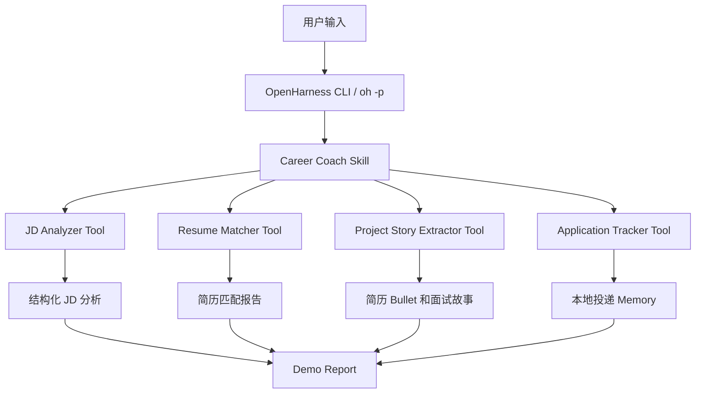

# CareerPilot Agent

[English](README.md) · [简体中文](README.zh-CN.md)

**CareerPilot Agent** 是一个基于 OpenHarness 二次开发的个人求职流程智能体。

它面向求职场景，帮助用户完成岗位 JD 分析、简历匹配、项目经历提炼、面试准备计划生成和投递状态管理。项目目标不是做一个普通聊天机器人，而是基于 OpenHarness 的 Tool、Skill、Memory 和 CLI 能力，构建一个可运行、可测试、可演示、可写进简历的垂直领域 Agent 项目。

---

## 项目背景

求职过程中，用户经常需要针对不同岗位重复完成以下工作：

- 阅读岗位描述，判断岗位真正需要什么能力。
- 对照自己的简历，找出匹配点和短板。
- 针对岗位重写项目经历和简历 bullet。
- 根据短板准备面试复习计划。
- 记录投递状态和下一步动作。

这些任务如果手动完成，通常耗时较长，而且容易不系统。

CareerPilot Agent 将这个过程整理成一个结构化工作流：

```text
岗位 JD
  -> JD 分析
  -> 简历匹配
  -> 项目经历提炼
  -> 面试准备计划
  -> 投递状态记录
```

---

## 为什么基于 OpenHarness？

OpenHarness 提供了轻量级 Agent Harness 的基础能力，包括：

- CLI 运行方式
- Tool-use 工作流
- Markdown Skill 加载
- 本地 Memory 模式
- 权限与执行边界
- dry-run 检查
- 可测试的 Python 项目结构

CareerPilot Agent 在 OpenHarness 上层扩展求职场景能力，把通用 Agent 框架转化为一个具体的求职流程智能体。

---

## 核心功能

### 1. JD Analyzer

JD Analyzer 用于解析岗位描述，输出结构化岗位分析。

输出内容包括：

- 岗位一句话总结
- 岗位级别判断
- 核心技能
- 加分技能
- 主要职责
- 简历关键词
- 面试关注点
- 风险提示

---

### 2. Resume Matcher

Resume Matcher 用于对比简历和岗位要求，生成可解释的岗位匹配报告。

输出内容包括：

- 匹配分数
- 强匹配项
- 缺失技能
- 证据不足的经历
- 建议补充的关键词
- 简历改写建议
- 面试准备主题

匹配分数不是黑盒分数，而是基于技能覆盖、项目证据和岗位职责覆盖进行解释性计算。

---

### 3. Project Story Extractor

Project Story Extractor 用于把项目 README 或项目说明转化为适合简历和面试表达的项目经历。

输出内容包括：

- 项目一句话总结
- 技术栈
- 架构亮点
- 中文简历 bullet
- 英文简历 bullet
- 面试讲述故事
- 可能被问到的面试问题

---

### 4. Application Tracker

Application Tracker 使用本地 JSON 文件保存投递记录。

支持：

- 新增投递记录
- 更新投递状态
- 查询当前申请
- 生成下一步动作

当前 MVP 使用轻量 JSON 文件，而不是数据库，方便本地演示、测试和人工检查。

---

### 5. OpenHarness Skill 集成

CareerPilot 使用 Markdown Skill 描述求职场景工作流，让 OpenHarness 能够识别和组织 CareerPilot 的求职任务。

当前包含：

```text
careerpilot/skills/
  career-coach.md
  resume-rewriter.md
  interview-prep.md
```

---

## 项目结构

```text
careerpilot/
  __init__.py
  demo.py
  openharness_adapter.py
  tools/
    jd_analyzer.py
    resume_matcher.py
    project_story_extractor.py
    application_tracker.py
  skills/
    career-coach.md
    resume-rewriter.md
    interview-prep.md
  memory/
    applications.json

examples/
  careerpilot/
    sample_jd_backend.md
    sample_resume.md
    sample_project_readme.md
    output_jd_analysis.json
    output_resume_match.md
    output_project_bullets.md
    demo_report.md

tests/
  careerpilot/
    test_jd_analyzer.py
    test_resume_matcher.py
    test_project_story_extractor.py
    test_application_tracker.py

docs/
  dev_log.md
  demo_script.md
  openharness_integration.md
```

---

## 系统架构



---

## 快速开始

### 1. 克隆仓库

```bash
git clone https://github.com/LYH0438/openharness-careerpilot.git
cd openharness-careerpilot
git checkout feature/careerpilot-agent
```

### 2. 安装依赖

```bash
uv sync
```

### 3. 运行 CareerPilot Demo

```bash
python -m careerpilot.demo \
  --jd examples/careerpilot/sample_jd_backend.md \
  --resume examples/careerpilot/sample_resume.md \
  --project examples/careerpilot/sample_project_readme.md \
  --output examples/careerpilot/demo_report.md
```

### 4. 查看输出报告

```bash
cat examples/careerpilot/demo_report.md
```

---

## OpenHarness Dry Run 示例

CareerPilot 也可以通过 OpenHarness 风格的 prompt 触发 dry-run 检查：

```bash
uv run oh --dry-run -p "Use career-coach skill. Analyze examples/careerpilot/sample_jd_backend.md and compare it with examples/careerpilot/sample_resume.md. Generate a job-fit report using CareerPilot."
```

dry-run 用于检查运行配置、prompt 组装、skill 发现和执行准备状态，不会真正执行模型调用或工具调用。

---

## 示例输出

CareerPilot 可以生成完整的岗位匹配报告，包括：

- JD 分析
- 简历匹配分
- 缺失技能分析
- 简历改写建议
- 项目经历 bullet
- 面试准备主题
- 投递状态摘要

示例文件位于：

```text
examples/careerpilot/
```

---

## 测试

运行 CareerPilot 专属测试：

```bash
python -m pytest -q tests/careerpilot
```

当前结果：

```text
18 passed in 0.05s
```

运行 OpenHarness 全仓库测试：

```bash
python -m pytest -q
```

当前结果：

```text
1067 passed, 6 skipped in 23.88s
```

---

## 实现细节

### 结构化输出

CareerPilot 的工具输出稳定的字典和 Markdown 报告，便于测试、展示和后续自动化处理。

### 可解释匹配分

Resume Matcher 的匹配逻辑不是单纯让模型给分，而是基于以下因素进行解释性计算：

```text
match_score = 技能覆盖 + 项目证据覆盖 + 岗位职责覆盖
```

分数会被限制在 0 到 100 之间，避免异常输出。

### 本地 Memory

Application Tracker 使用本地 JSON 文件保存投递记录：

```text
careerpilot/memory/applications.json
```

这种方式适合 MVP 阶段，因为它简单、可读、易测试，不需要额外数据库服务。

### Skill 驱动工作流

CareerPilot 使用 Markdown Skill 定义求职工作流。Skill 文件描述了何时使用该流程、需要哪些输入、应该调用哪些工具，以及最终应该输出什么报告。

---

## 开发日志

开发过程记录在：

```text
docs/dev_log.md
```

当前已完成里程碑：

- Day 1：OpenHarness 环境搭建
- Day 2：CareerPilot Skill 草稿
- Day 3：JD Analyzer Tool
- Day 4：Resume Matcher Tool
- Day 5：Project Story Extractor
- Day 6：Application Tracker
- Day 7：端到端 Demo Flow
- Day 8：OpenHarness 运行方式接入
- Day 9：测试与稳定性验证
- Day 10：README 第一版

---

## Roadmap

### v0.1 MVP

- [x] JD Analyzer
- [x] Resume Matcher
- [x] Project Story Extractor
- [x] Application Tracker
- [x] 端到端 Demo Report
- [x] OpenHarness dry-run 集成
- [x] 核心测试

### v0.2 计划增强

- [ ] ohmo / IM 渠道接入
- [ ] 简历与项目知识库
- [ ] 多 Agent 求职工作流
- [ ] Benchmark 与质量评估
- [ ] GitHub 项目理解器
- [ ] 简历版本管理
- [ ] 安全策略与人工审核流程

---

## 简历描述

### 中文版

基于 OpenHarness 二次开发 CareerPilot Agent 求职流程智能体，扩展 JD 解析、简历匹配、项目经历提炼和投递记录管理工具，结合 Markdown Skill、本地 JSON Memory、结构化输出、端到端 Demo 和 pytest 测试，实现从岗位分析到简历优化和面试准备的自动化闭环。

### 英文版

Built CareerPilot Agent, a domain-specific job-search agent on top of OpenHarness. Implemented custom tools for JD parsing, resume-job matching, project story extraction, and application tracking, with structured outputs, local JSON memory, markdown skills, CLI demo workflow, and pytest-based validation.

---

## 当前限制

- 当前匹配分是启发式评分，重点是可解释和可测试，而不是严格 benchmark 后的模型评分。
- 简历修改建议必须经过人工审核后才能用于真实投递。
- 当前 OpenHarness 集成以 dry-run 和 skill-guided workflow 验证为主。
- ohmo / IM 渠道接入计划放在后续版本完成。

---

## License

本项目基于 OpenHarness fork 后进行场景化扩展。基础框架许可请参考上游 OpenHarness 项目 license。
